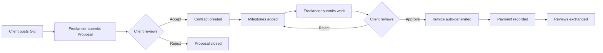

<div align="center">


<br/>


<br/><br/>


<br/><br/>


**A backend platform for the freelance economy — gig discovery, contracts, milestones, invoicing, and reviews, all enforced by domain logic.**

<br/>

[🚀 Live API](https://inkpact-production-0e41.up.railway.app/scalar/v1) · [⚡ Quick Start](#-try-it-live) · [🏗️ Architecture](#%EF%B8%8F-architecture) · [🔄 Workflow](#-the-inkpact-workflow) · [📦 Tech Stack](#-tech-stack) · [📜 Licenses](#-third-party-licenses)

</div>

---

## What is Inkpact?

Inkpact is a freelancing marketplace API that handles the full client–freelancer lifecycle: **clients post gigs, freelancers submit proposals, accepted proposals turn into contracts with milestone tracking, approved milestones auto-generate invoices, and completed work flows through reviews.**

The interesting parts aren't the CRUD endpoints — they're the moments where one action triggers a chain of domain logic. Approving a milestone doesn't just flip a status; it creates an invoice, generates line items, publishes a domain event, and commits everything in a single transaction. That's where Inkpact tries to look like real software, not a tutorial app.

It's designed as a portfolio piece demonstrating production-grade backend architecture in modern .NET — Clean Architecture, CQRS via MediatR, layered authorization, and a strict separation where domain logic never bleeds into infrastructure concerns.

---

## 🚀 Try it live!

The API is deployed and ready to test. No setup required — interactive API docs are open to the public.

> **[🔗 Open Scalar API Reference](https://inkpact-production-0e41.up.railway.app/scalar/v1)**

### A 60-second walkthrough

**1. Register a Client account**

`POST /api/auth/register`

```json
{
  "email": "demo@inkpact.dev",
  "password": "DemoPass123!",
  "fullName": "Demo Client",
  "role": 0
}
```

> *Roles: `0` = Client, `1` = Freelancer. Admin registration is blocked at the validation layer.*

**2. Log in to get a JWT**

`POST /api/auth/login`

```json
{
  "email": "demo@inkpact.dev",
  "password": "DemoPass123!"
}
```

Copy the returned `token` value.

**3. Authorize Scalar**

Click the auth panel at the top of Scalar and paste your token into the **Bearer** field. Every protected request will include it automatically.

**4. Post a gig**

`POST /api/gigs`

```json
{
  "title": "Build a portfolio website",
  "description": "Need a clean, fast portfolio site with three pages and a contact form.",
  "budget": 5000,
  "deadline": "2026-08-01T23:59:59Z",
  "tags": [".NET", "React"]
}
```

**5. Verify**

`GET /api/gigs` — your new gig appears in the list. To see the full lifecycle in action, register a separate Freelancer account, submit a proposal, accept it as the Client, and approve a milestone to trigger auto-invoicing.

---

## ✨ Features

| Feature | Description |
|---|---|
| 🔐 **JWT Authentication** | Stateless Bearer-token auth with role-based authorization for Clients, Freelancers, and Admins. |
| 📋 **Gig Marketplace** | Clients post gigs with budget, deadline, and tags. Freelancers browse, filter, and submit proposals. |
| 🤝 **Proposal Workflow** | Freelancers bid; clients accept or reject. Acceptance automatically spawns a contract and links the parties. |
| 📄 **Contracts & Milestones** | Contracts hold milestones with their own status flow: `Pending → Submitted → Approved`. |
| 💸 **Auto-generated Invoices** | Approving a milestone atomically creates an invoice with line items, sets a 14-day payment term, and publishes a domain event. |
| 🧾 **Invoice Lifecycle** | `Draft → Sent → Paid → Overdue` with role-gated transitions. |
| ⭐ **Reviews** | Two-sided rating system after contract completion. |
| ✅ **Validation Pipeline** | FluentValidation rules run automatically before every command, returning clean 400 errors with field-level details. |
| 🛡️ **Global Exception Handling** | Custom middleware converts domain exceptions into proper HTTP responses with structured error bodies. |
| 📚 **OpenAPI + Scalar** | Live, interactive API reference — no separate docs to maintain, always synced with the code. |

---

## 🔄 The Inkpact Workflow

The core domain models a real-world freelance engagement from discovery through payment:



Each transition is enforced by a MediatR handler with role-checked authorization. Out-of-order or unauthorized actions are rejected at the application layer with descriptive `OperationResult` failures, never reaching the database.

---

## 🏗️ Architecture

Inkpact uses **Clean Architecture** with strict dependency rules: outer layers depend on inner layers, never the reverse.

```
┌─────────────────────────────────────────────────────────────┐
│  InkpactAPI (Presentation)                                  │
│  Controllers · Middleware · OpenAPI · DI Composition Root   │
├─────────────────────────────────────────────────────────────┤
│  Application (Use Cases)                                    │
│  MediatR Handlers · Validators · DTOs · Pipeline Behaviours │
├─────────────────────────────────────────────────────────────┤
│  Infrastructure (External Concerns)                         │
│  EF Core · Repositories · JWT Service · UnitOfWork          │
├─────────────────────────────────────────────────────────────┤
│  Domain (Core)                                              │
│  Entities · Enums · Events · Domain Interfaces · Common     │
└─────────────────────────────────────────────────────────────┘
```

### Request lifecycle

A typical write request flows through several stages, each with a single responsibility:

```
HTTP Request
   │
   ▼
[Controller]                    Thin — extracts caller ID, builds command, calls MediatR
   │
   ▼
[LoggingBehaviour]              Wraps the call with structured logging
   │
   ▼
[ValidationBehaviour]           Runs FluentValidators; throws on failure
   │
   ▼
[Command Handler]               Orchestrates the use case via UnitOfWork
   │
   ▼
[Repository + UnitOfWork]       Persists via EF Core in a single transaction
   │
   ▼
[Domain Event Publisher]        Notifies the rest of the system (e.g. MilestoneApprovedEvent)
   │
   ▼
[OperationResult]               Returned to controller and mapped to HTTP status
   │
   ▼
[GlobalExceptionMiddleware]     Catches anything unhandled → clean HTTP response
```

### Domain model

The domain centers around the freelance lifecycle:

| Entity | Role |
|---|---|
| **User** | Base account with a `UserRole` enum (`Client`, `Freelancer`, `Admin`) |
| **FreelancerProfile** | Extended profile data — bio, skills, hourly rate — only for Freelancer accounts |
| **Gig** | Posted job with budget, deadline, and tags |
| **Proposal** | Freelancer's bid on a gig |
| **Contract** | Agreement created when a proposal is accepted; supports termination with reason |
| **Milestone** | Discrete deliverable under a contract with its own lifecycle |
| **Invoice** | Billing document with status: `Draft → Sent → Paid → Overdue` |
| **InvoiceLineItem** | Individual billable line tied to a milestone |
| **Review** | Post-completion rating left by either party |

### API surface

The API is grouped into eight controllers:

- **Auth** — `POST /api/auth/register`, `POST /api/auth/login`
- **Gigs** — CRUD + close/cancel actions, role-gated to Clients
- **Proposals** — Freelancer-submitted bids with accept/reject by Client
- **Contracts** — Read views, termination flow
- **Milestones** — Add (Client), Submit (Freelancer), Approve (Client → triggers invoicing)
- **Invoices** — Read views and `MarkAsPaid`
- **Reviews** — Post-contract ratings

Authorization is layered: a class-level `[Authorize]` baseline ensures every endpoint requires a token, and per-endpoint role overrides (`[Authorize(Roles = "Client")]`, `[Authorize(Roles = "Freelancer")]`) enforce who can do what.

---

## 📦 Tech Stack

| Layer | Technology |
|---|---|
| **Runtime** | .NET 10, C# |
| **Web Framework** | ASP.NET Core |
| **ORM** | Entity Framework Core 10 with Npgsql provider |
| **Database** | PostgreSQL 16 |
| **Mediator / CQRS** | MediatR (commands, queries, pipeline behaviours, domain events) |
| **Validation** | FluentValidation |
| **Authentication** | JWT Bearer tokens (Microsoft.IdentityModel.Tokens) |
| **API Documentation** | Scalar API Reference + Microsoft.AspNetCore.OpenApi |
| **Containerization** | Docker (multi-stage build) |
| **Hosting** | Railway (API + managed Postgres) |
| **Local Development** | Docker Compose for Postgres |

---

## 🛠️ Local Development

### Prerequisites

- .NET 10 SDK
- Docker Desktop (for the local Postgres container)
- Git

### Setup

```bash
# Clone
git clone https://github.com/ElvisNilssonDev/Inkpact.git
cd Inkpact

# Start Postgres
docker compose up -d

# Configure JWT secret (User Secrets, not committed)
dotnet user-secrets init --project src/InkpactAPI
dotnet user-secrets set "JwtSettings:SecretKey" "<your-32+-char-secret>" --project src/InkpactAPI

# Apply migrations
dotnet ef database update --project src/Infrastructure --startup-project src/InkpactAPI

# Run
dotnet run --project src/InkpactAPI
```

The API will be available at `https://localhost:7285` and Scalar at `https://localhost:7285/scalar/v1`.

### Connection string

The dev connection string lives in `src/InkpactAPI/appsettings.Development.json` (gitignored). Default values match `docker-compose.yml`:

```
Host=localhost;Port=5432;Database=inkpact;Username=inkpact;Password=inkpact_dev_pw
```

### Production environment variables

| Variable | Purpose |
|---|---|
| `ASPNETCORE_ENVIRONMENT` | Set to `Production` |
| `ConnectionStrings__DefaultConnection` | Postgres connection string |
| `JwtSettings__SecretKey` | HMAC signing key (min 32 chars) |
| `JwtSettings__Issuer` | JWT issuer claim |
| `JwtSettings__Audience` | JWT audience claim |
| `JwtSettings__ExpirationMinutes` | Token TTL in minutes |

---

## 🗂️ Project Structure

```
src/
├── Domain/                  # Entities, enums, events, domain interfaces, OperationResult
├── Application/             # MediatR commands/queries, validators, DTOs, pipeline behaviours
├── Infrastructure/          # EF Core, AppDbContext, repositories, JWT service, UnitOfWork
└── InkpactAPI/              # Controllers, middleware, OpenAPI config, composition root
tests/                       # Unit and integration tests
assets/                      # Logo and other static assets
docker-compose.yml           # Local Postgres for development
Dockerfile                   # Production build (multi-stage)
```

---

## 🚢 Deployment

The API is containerized via a multi-stage Dockerfile (SDK image for build, runtime image for execution) and deployed on Railway. Postgres is provisioned as a managed Railway service. EF Core migrations are applied automatically at startup, so every deploy reconciles the schema with the latest model.

The deploy pipeline is push-based: a commit to the deploy branch triggers a fresh build, runs migrations, and rolls out the new version with zero manual steps. Railway's reverse proxy terminates SSL and forwards as HTTP to the container — `UseForwardedHeaders` is configured so the app correctly identifies HTTPS requests and generates valid public URLs in the OpenAPI document.

---

## 🧠 Design Decisions

A few choices worth calling out for anyone reading the source:

- **Clean Architecture over a flat structure.** The domain knows nothing about EF Core, HTTP, or JWT. This makes the core testable in isolation and keeps the dependency graph one-way.
- **MediatR for command/query handling.** Each use case is a single class with one responsibility, instead of fat services with many methods. Pipeline behaviours handle cross-cutting concerns (logging, validation) without polluting handlers.
- **`OperationResult<T>` pattern instead of throwing for control flow.** Handlers return success or typed failures (`NotFound`, `Unauthorized`, `Conflict`, `ValidationFailed`). Controllers map the result to HTTP status codes via a `ToActionResult()` extension. Exceptions are reserved for genuinely exceptional situations.
- **FluentValidation in a pipeline behaviour.** Validation runs before every handler automatically. Handlers assume their input is valid, simplifying the happy path.
- **Repository + UnitOfWork over raw `DbContext` access in handlers.** Keeps persistence concerns out of the application layer and makes it possible to swap implementations or mock for tests.
- **Domain events for side effects.** When a milestone is approved, a `MilestoneApprovedEvent` is published. This keeps the approval handler focused on its primary responsibility while leaving room for future side effects (notifications, analytics) without modifying the handler itself.
- **Auto-migration on startup.** Trades a tiny startup-time risk for guaranteed schema consistency. Acceptable for this scale; would be replaced with a separate migration step in higher-stakes production environments.

---

## 📜 Third-Party Licenses

This project uses several open-source libraries. All major dependencies and their licenses are listed below. Full license texts are available on each package's NuGet page or upstream repository.

| Package | License |
|---|---|
| Microsoft.AspNetCore.* | MIT |
| Microsoft.EntityFrameworkCore | MIT |
| Microsoft.EntityFrameworkCore.Design | MIT |
| Npgsql.EntityFrameworkCore.PostgreSQL | PostgreSQL License (BSD-style) |
| Npgsql | PostgreSQL License (BSD-style) |
| Microsoft.AspNetCore.Authentication.JwtBearer | MIT |
| Microsoft.IdentityModel.Tokens | MIT |
| MediatR | Apache 2.0 |
| FluentValidation | Apache 2.0 |
| Microsoft.AspNetCore.OpenApi | MIT |
| Scalar.AspNetCore | MIT |

> **Note:** Verify license terms on each package's official source before commercial use. License information here is provided in good faith but may change between versions.

---

## 👤 Author

**Elvis Nilsson** — backend developer, .NET focus, based in Sweden.  
[GitHub: @ElvisNilssonDev](https://github.com/ElvisNilssonDev)

---

<div align="center">

<i>Built with C# and Clean Architecture · Deployed on Railway · Forged in Trust</i>

</div>
